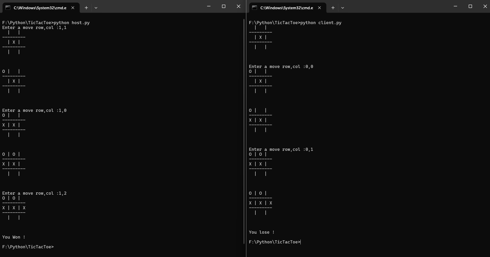

# Networked Tic-Tac-Toe Game using Python Sockets

A simple 2-player Tic-Tac-Toe game that works over a local network using Python’s `socket` and `threading` modules. You can either host a game or join one as a client.

---

## 📌 Features

- ✅ Real-time 2-player game over a local network
- ✅ Python socket-based connection
- ✅ Turn-based logic
- ✅ Detects win, lose, and draw situations
- ✅ Clean board display after each move

---

## 📂 Project Structure

```
TICTACTOE/
├── results/
│   ├── demo.png
├── main.py       # Contains game logic and socket communication
├── host.py       # Host starts the server and plays as 'X'
├── client.py     # Client connects to the host and plays as 'O'
└── README.md     # Project documentation
```

---

## 🚀 How to Run

1. **Clone this repo**
   ```bash
   git clone https://github.com/your-username/tictactoe.git
   cd tictactoe
   ```

2. **Start the host (Player X)**
   ```bash
   python host.py
   ```

3. **Start the client (Player O) in another terminal or device**
   ```bash
   python client.py
   ```

✅ *Ensure both the host and client are on the same local network (or use public IP and port forwarding if remote).*

---

## 🎮 Game Instructions

- Enter your move as `row,col` where:
  - `row` and `col` are 0, 1, or 2
  - Example: `1,2` means middle row, rightmost column
- The board updates after each move.
- The game ends when:
  - One player wins
  - It's a draw (9 moves with no winner)

---

## 🧠 Behind the Scenes (Esz)

- `main.py` contains the `TICTACTOE` class which manages:
  - Board state
  - Move validation
  - Turn switching
  - Socket communication
  - Win/tie checking
- `host_game(host, port)` starts a TCP server, waits for connection.
- `connect_to_game(host, port)` connects as a client.
- Moves are passed as strings and decoded/encoded over sockets.
- `threading.Thread()` ensures non-blocking communication for real-time play.

---

## 🔧 Requirements

- Python 3.x
- No external libraries — uses `socket` and `threading` only

## 📷 Game Demo Screenshots

### 🎮 Different player in each terminals


## 🌐 Play Over Same Wi-Fi (Different Laptops)

You can play this game between two laptops connected to the **same Wi-Fi** by using the **host machine’s local IP address** instead of `localhost`.

### 🖥️ Host (Player X) Steps

1. **Find your local IP address**:
   - On Windows:
     ```bash
     ipconfig
     ```
     Look for the `IPv4 Address`, e.g., `192.168.1.5`
   - On Linux/macOS:
     ```bash
     ifconfig
     ```
     or
     ```bash
     ip a
     ```

2. **Edit `host.py`**:
   ```python
   game.host_game('192.168.1.5', 9999)  # Replace with your local IP
   ```

3. **Run**:
   ```bash
   python host.py
   ```

### 💻 Client (Player O) Steps

1. **Edit `client.py`**:
   ```python
   game.connect_to_game('192.168.1.5', 9999)  # Same IP as host
   ```

2. **Run**:
   ```bash
   python client.py
   ```

---
